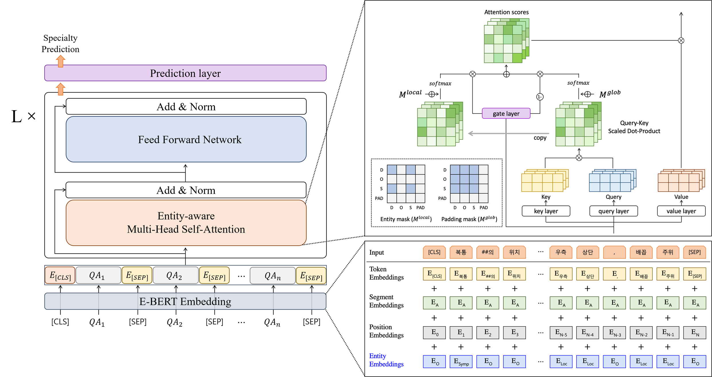

# Entity-enhanced BERT for Medical Specialty Prediction Based on Clinical Questionnaires Data

[](https://doi.org/10.1371/journal.pone.0317795)  
[](https://www.python.org/)  
[](LICENSE)  

This repository provides the official implementation of **"Entity-enhanced BERT for Medical Specialty Prediction Based on Clinical Questionnaire Data,"** accepted at **PLoS ONE, 2025**.  

📄 **Paper**: [🔗 Read on PLOS ONE](https://doi.org/10.1371/journal.pone.0317795)


## Overview  

**E-BERT** is a domain-specific **BERT-based model** designed for **medical specialty prediction** based on **clinical questionnaire data**.  
It integrates **entity-aware embeddings** and **entity-enhanced attention** to improve performance in long-sequence clinical text classification.



### **Contributions**  
- **Entity Embedding Layer**: Injects domain-specific medical knowledge (symptoms, pain location, diseases) into BERT.  
- **Entity-aware Attention**: Enhances relationships between medical entities to improve text classification.  
- **Improved Performance**: Outperforms existing deep learning models for clinical text classification, especially on long-text inputs.  


## Dataset

This study utilized 27,037 QA pairs from 1,788 participants, collected from Korea University Anam Hospital.
Since the dataset contains sensitive medical data, it cannot be publicly released.

For data access requests, please contact Korea University IRB: 📩 kuirb@korea.ac.kr.

## Main results 
- **E-BERT outperforms all benchmark models** in Accuracy (0.834), Precision (0.777), Recall (0.773), Macro F1 (0.760), and MCC (0.735).  
- Compared to **BERT**, E-BERT achieves better **Recall (+2.7%)**, **Macro F1 (+2.6%)**, and **MCC (+0.9%)**.
- **E-BERT significantly outperforms** standard BERT in long-sequence text classification.  
- **Entity information improves performance**, especially in **imbalanced medical data**.


| Model          | Accuracy | Precision | Recall  | Macro F1 | MCC   |
|----------------|----------|-----------|---------|----------|-------|
| BiRNN          | 0.668    | 0.590     | 0.617   | 0.564    | 0.463 |
| BiGRU          | 0.775    | 0.701     | 0.702   | 0.690    | 0.636 |
| BiLSTM         | 0.668    | 0.611     | 0.595   | 0.558    | 0.460 |
| TextCNN        | 0.813    | 0.729     | 0.741   | 0.724    | 0.696 |
| CNN+LSTM       | 0.809    | 0.736     | 0.738   | 0.728    | 0.689 |
| ELECTRA        | 0.765    | 0.726     | 0.672   | 0.648    | 0.621 |
| DistilBERT     | 0.777    | 0.706     | 0.690   | 0.678    | 0.641 |
| **BERT (Baseline)** | 0.830 | 0.756     | 0.746   | 0.734    | 0.726 |
| **E-BERT (Ours)**   | **0.834** | **0.777** | **0.773** | **0.760** | **0.735** |


## Citation  

If you find this work useful, please cite our paper:  

```bibtex
@article{lee2025entity,
  title={Entity-enhanced BERT for medical specialty prediction based on clinical questionnaire data},
  author={Lee, Soyeon and Han, Ye Ji and Park, Hyun Joon and Lee, Byung Hoon and Son, DaHee and Kim, SoYeon and Yang, HyeonJong and Han, TaeJun and Kim, EunSun and Han, Sung Won},
  journal={PloS one},
  volume={20},
  number={1},
  pages={e0317795},
  year={2025},
  publisher={Public Library of Science San Francisco, CA USA}
}
```

## License  

This project is licensed under the **MIT License** - see the [LICENSE](LICENSE) file for details.  